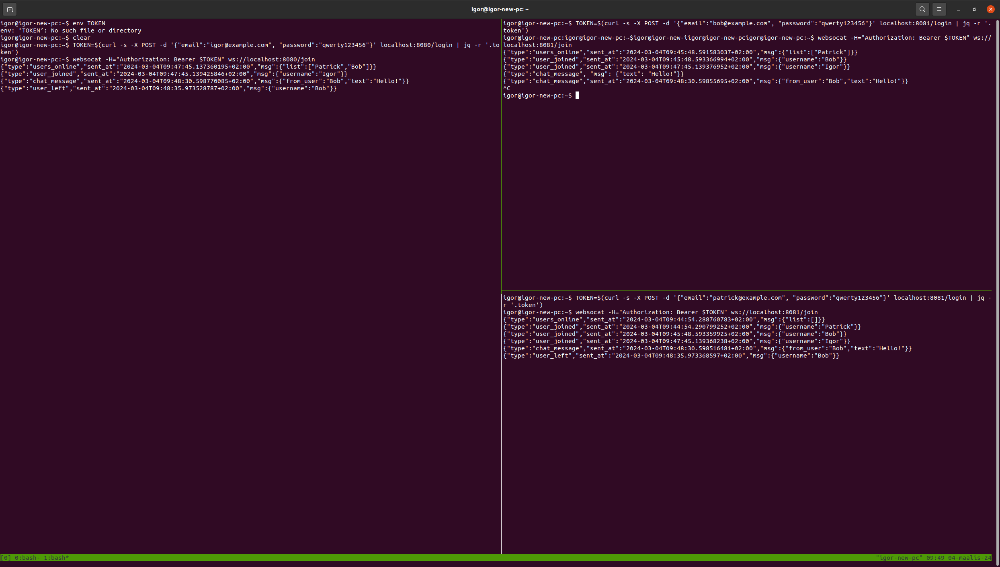

## About

ich is a backend of a hypotetical *lobby chat*, implemented as this [assignment](https://github.com/noice-com/developer-assignment). The chat implements only required features (getting the list of users online, updates on users joining and leaving, receiving and sending messages, etc.) and do not implement other features that would be nice to have in the real-world application (e.g. chat history or the ability to edit and delete messages).

## Architecture

The server uses Apache Kafka to exchange chat messages and synchronize the list of users. It is horizontally scalable, i.e. you can run multiple instances of the server, optionally connecting them to different Apache Kafka replicas.

The server exposes API through websockets and uses JWT for authentication. To simplify the testing, the server also implements several user management REST API endpoints.

API is documented [here](doc/api.md).

PostgreSQL is used to store user accounts and if necessary it could be used to continuously backup chat messages from the Kafka topic using Kafka Streams. This would allow e.g. to preserve long-term chat history outside of Kafka topic retention policy. 

## Running Locally

Build the server:

```bash
make build
```

Start docker-compose to set up a local testing environment:
```bash
docker-compose up -d
```

The server reads configuration using `.env` file and environment variables. The repo has `.env` configured to use the test environment, and you can just run the server:

```
./server
```

If you want to run several instances, bind them on different ports:

```
ICH_PORT=8081 ./server
```

## Testing from CLI

Note: I like testing the backend using CLI tools, but feel free to use Postman or whatever you like.

Create one ore more test users:
```bash
curl -X POST -d '{"email":"igor@example.com", "username":"Igor", "password":"qwerty123456"}' localhost:8080/createUser
```

Authenticate and get the access token:
```bash
TOKEN=$(curl -s -X POST -d '{"email":"igor@example.com", "password":"qwerty123456"}' localhost:8080/login | jq -r '.token')
```

Join the chat:
```bash
websocat -H="Authorization: Bearer $TOKEN" ws://localhost:8080/join
```

You should see something like this:

```
{"type":"users_online","sent_at":"2024-03-04T09:16:14.60911171+02:00","msg":{"list":[]}}
{"type":"user_joined","sent_at":"2024-03-04T09:16:14.610345784+02:00","msg":{"username":"Igor"}}
```

Post a message to the chat (by entering the JSON in the console). You should get something like this:

```
{"type":"chat_message", "msg": {"text": "Hello!"}}
{"type":"chat_message","sent_at":"2024-03-04T09:19:55.903219951+02:00","msg":{"from_user":"Igor","text":"Hello!"}}
```

## Example

Here is an example of three users connecting to two different server instances (on `:8080` and `:8081`) and interacting with each other:


